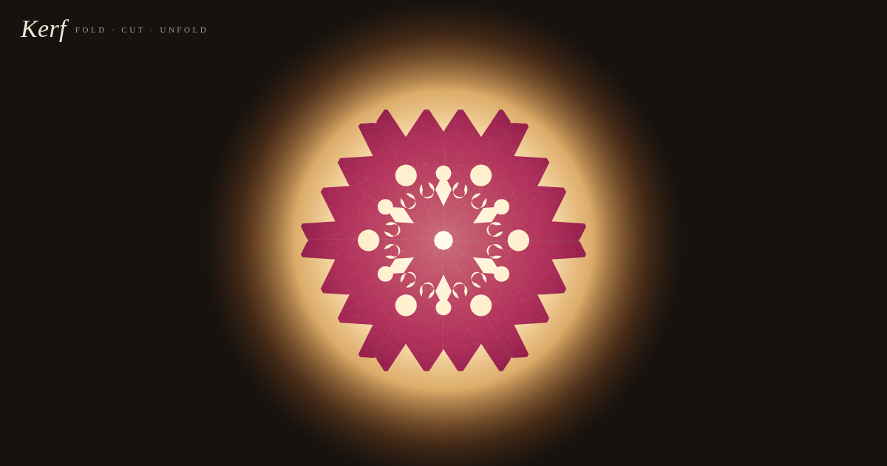

# Kerf

Day 11 · Oct 9, 2026 · interactive paper-craft / symmetry toy

**Live:** https://swalker326.github.io/dreamer-builds/kerf/

Kerf is a quiet paper-cutting toy, in the tradition of kirigami, papel picado, and the paper snowflake. You start with a sheet already folded into a wedge. Cut it, then press **Unfold**: the wedge opens one fold at a time, with mirrored copies flipping out across each crease. The finished sheet is held up to a lamp, so light shines through the holes. It is one self-contained `index.html` with no network dependencies, and it works with mouse or touch.

## Use

- **Cut:** drag a freehand loop over the wedge (lasso). You can also tap points one by one and tap the first point again to close a polygon (Enter or double-click also close it; Esc cancels). Each piece you cut out falls away.
- **4 / 6 / 8:** the symmetry order. 6 makes classic snowflakes. **Mirror** on means real folding, a dihedral group with 2k layers. Mirror off means rotation only, k layers fanned out like a pinwheel, which gives patterns with a handedness.
- **Random:** draws a pattern for you: scalloped, notched, or pointed outer edges; motifs that sit on the fold lines (so they become whole, symmetric shapes); interior teardrops, leaves, and crescents; and a centre hole.
- **Undo** (⌘/Ctrl-Z), **New**, twelve paper colours (washi tones: kinari, sakura, kaki, matcha, asagi, ai; papel picado brights: rosa, naranja, amarillo, verde, turquesa, morado), and **Save** (a 2048×2048 backlit PNG).

## How it works

- Every cut is stored as a polygon in wedge coordinates (the wedge's apothem is 1). Nothing is stored as pixels, so the result is exact at any size.
- **Folded view:** the wedge triangle is drawn and every cut polygon is erased from it (nonzero fill, so self-crossing lassos behave as you'd expect). The piece that falls away is computed by exact Sutherland–Hodgman clipping of the cut against the wedge's three half-planes. That piece is rendered with the earlier cuts subtracted, then dropped with simple gravity and spin.
- **Unfold animation:** the symmetry group is built as a sequence of fold stages. Each stage reflects every existing layer across one or more fold lines. The order is 45°→90°→0° for 4-fold, 30°→(60°, 0°)→120° for 6-fold (fold in half, then in thirds, then in half again), and 22.5°→45°→90°→0° for 8-fold. A layer flipping out is drawn with the transform `R(a)·diag(1, cos πp)·R(−a)`, a 3D-style flip across its crease, with a lift shadow and edge-on shading. In rotation-only mode the stack fans out one layer at a time.
- **Final sheet:** this is not a stitch of the animated pieces. The k-gon sheet is painted once, and then each cut is erased under every group element, clipped to that element's wedge. The wedge is pushed out by about 1.6 device pixels along its fold edges, so no antialiasing hairline is left inside holes that cross a fold. Faint creases are drawn on top. The backlight is a warm radial lamp behind the sheet, and the paper is darkened and lit through from behind.

## Files

- `index.html`: the whole toy
- `test.py`: Playwright test. It makes lasso cuts by mouse drag and by real touch events, taps out a polygon, unfolds, saves a PNG, and runs random patterns for 8-mirror, 4-rotate, and 6-mirror on desktop and mobile (390×844). It asserts there are no console errors.
- `quick.py`: renders `preview.png` and extra proof shots
- `shot_*.png`: test screenshots
