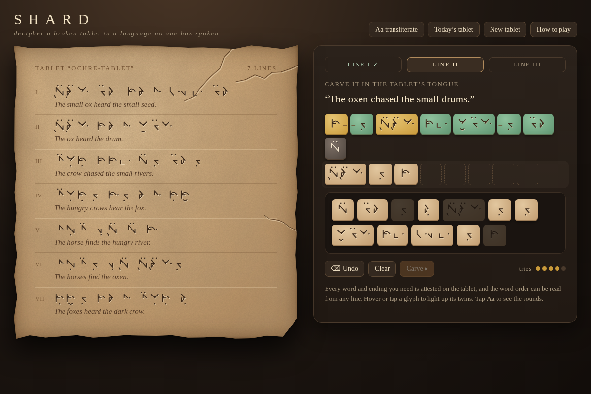

# Shard

Day 10 · Oct 7, 2026 · procedurally generated decipherment puzzle (linguistic logic / word game)

**Live:** https://swalker326.github.io/dreamer-builds/shard/

Shard is a broken clay tablet written in a language nobody has spoken. Each day's tablet (seeded by the date) comes with a new invented language: its own sounds, its own script, its own word order and grammar. Seven or so lines are carved on the tablet, each with a scribe's English gloss. You read three more lines, each harder than the last. It is one self-contained `index.html` with no network dependencies.

## How to play

- **Line I:** a sentence in the script. Arrange English word tiles to translate it (watch for *wolf* vs *wolves* and *sees* vs *saw*).
- **Lines II–III:** an English sentence. Arrange stem and affix tiles (affixes show a dash on the side where they attach) to write it in the tablet's language. Line III always has two adjectives, a plural, and the past tense.
- After each guess every tile is graded: green = right tile, right place; ochre = in the answer but somewhere else; grey = not in the answer. You get five tries per line.
- Hover or tap a glyph to light up every identical glyph. **Aa** toggles a transliteration.
- When you finish, the tablet's grammar and full lexicon are revealed, and **Share** copies a spoiler-free emoji grid.
- **New tablet** plays a random seed (`?seed=…` in the URL, so links can be shared). **Today's tablet** goes back to the daily one. Progress is saved per seed in localStorage.

## How the generator works

1. **Phonology:** each language picks 8–12 consonants and 3–5 vowels, a coda-*n* rate, and a vowel-initial rate. Stems are 1–3 CV(n) syllables. Affixes are single CV syllables. Every inflected form of every stem is checked to be a unique syllable string, so segmentation is never ambiguous.
2. **Grammar:** a word order is drawn by rough real-world frequency (SOV, SVO > VSO > VOS, OVS, OSV), along with adjective-before or adjective-after placement, a plural prefix or suffix, a past-tense prefix or suffix, an optional accusative case affix on objects (40%), and optional adjective plural agreement (30%).
3. **Script:** a generated **abugida**. Each consonant gets a unique connected figure of 2–4 strokes taken from a 3×3 grid of line and arc segments. Each vowel except the inherent one gets a diacritic mark, and a lower-left tick adds a final *-n*. Glyphs are SVG drawn twice, as a light offset plus a dark stroke, so they look carved into the clay.
4. **Solvability check (`verify`):** the tablet lines and the three targets are re-drawn until a careful reader could provably derive every answer:
   - every concept in a target appears on the tablet, and its *set of lines* is unique among all concepts (so no two words always co-occur and get confused);
   - every target word's morphological shape (for example noun+PL+ACC in that affix order) is attested on the tablet;
   - every affix used in a target is *contrasted*: some stem appears both with and without it, so it can be split off;
   - targets never copy a clue line, and word order can be read from any full line.
   Tile banks get distractor stems and affixes taken only from tablet words, so they can be ruled out by reasoning.

## Testing

`test.py` (Playwright) builds 200 seeds (0 failures; generation takes about 1 ms per tablet) and independently checks that every target morpheme occurs inside some tablet word and that every bank holds the full answer. It also plays a wrong guess and then the correct solve on all three lines, checks the reveal, clipboard sharing, persistence across reload, `?seed=`, new tablet, and transliteration, and confirms a 390 px mobile viewport has no horizontal overflow and handles taps. No console errors. `preview.py` renders `preview.png` (a non-daily seed, to avoid spoilers) and `mobile.png`.
