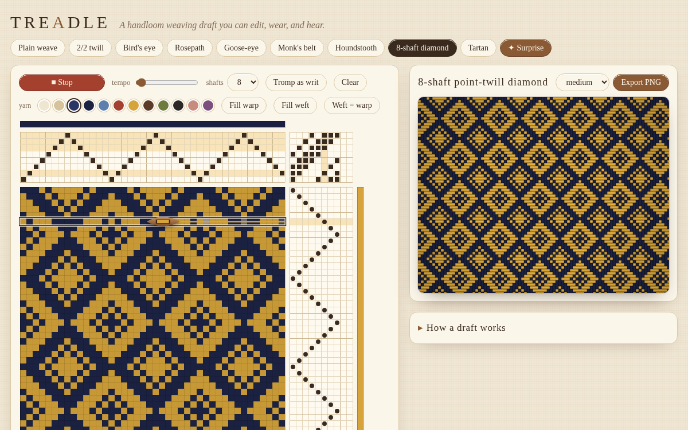

# Treadle

Day 9 · Oct 6, 2026 · interactive textile / weaving-draft music toy

**Live:** https://swalker326.github.io/dreamer-builds/treadle/

Treadle is a handloom **weaving draft** you can edit, see as cloth, and *play like a music-box roll*. It is a single self-contained `index.html` with no network dependencies.



## Using it

- **Presets** (traditional structures): Plain weave, 2/2 twill, Bird's eye (point twill), Rosepath (1-2-3-4-1-4-3-2), Goose-eye (extended point twill), Monk's belt (overshot-style blocks on 1-2 / 3-4 with tabby), Houndstooth (2/2 twill, 4-and-4 color), an 8-shaft point-twill diamond, and a twill Tartan. **✦ Surprise** generates a random but structured draft (straight / point / extended-point / random-walk threadings, twill tie-ups, optional tabby, curated plant-dye color pairs and stripes).
- **Threading** (top grid): click to put a warp end on a shaft (click the mark again to empty it). Drag to draw a line of threading.
- **Tie-up** (top-right corner): click/drag to toggle which shafts each treadle lifts.
- **Treadling** (right grid): click a cell to press that treadle on that pick (exclusive); shift-click to press several at once.
- **Colors**: pick a yarn from the swatches, then click/drag the warp color row (very top) or the weft color column (far right). *Fill warp*, *Fill weft*, *Weft = warp* (copy the stripe order for plaids).
- **Tromp as writ** treadles each pick on the same shaft as the matching warp end — the classic way to get a true diagonal / diamond.
- **Shafts** selector: 4, 6, or 8 shafts (treadles = shafts + 2).
- **Fabric preview** (right): the draft tiled as cloth with over/under thread shading. **Export PNG** saves an 1800×1200 fabric image.
- The draft is encoded in the URL hash, so any draft can be shared by copying the link.
- Works with touch: taps toggle cells, horizontal drags paint, vertical drags scroll the page.

## The draft math

Each warp end `w` hangs on one shaft `thr[w]`. Each treadle `t` lifts a set of shafts `tie[s][t]` (rising-shed / jack-loom convention). Each pick `p` presses a set of treadles `trd[p][t]`.

```
warpUp(p, w) = OR over t of ( trd[p][t] AND tie[ thr[w] ][t] )
cell color  = warpUp ? warpColor[w] : weftColor[p]
```

That's the whole drawdown. The status line also reports the longest warp and weft floats (a ⚠ appears over 7, where real cloth would snag).

Verified in headless Chromium: Plain weave gives a perfect checkerboard (`dd[p][w] = dd[0][0] XOR (p+w) mod 2` everywhere), and 2/2 twill gives an exact diagonal (`dd[p][w] = dd[p+1][w±1]`) with every row half up.

## The fabric rendering

Per pixel, each thread cell is shaded as a little cylinder: warp-on-top cells get a cross-section highlight across their width and darken where the warp dives under at a float end (`pick-1` / `pick+1` down); weft-on-top cells get the same treatment rotated. A faint diagonal striation suggests yarn twist, plus a small per-thread brightness jitter and a soft vignette.

## Playing the cloth (audio mapping)

- The shuttle sweeps one pick per beat (tempo slider), alternating left→right and right→left like a real shuttle. The current pick is outlined, its treadles and lifted shafts glow, and a wooden shuttle glyph carries the weft across.
- A note sounds only where a warp end **rises to the surface** on this pick (up now, down on the previous pick), timed by when the shuttle passes it.
- Pitch: pentatonic major from D3. Scale degree = `shaft + 3 × zone`, where the warp is split into 4 zones across its width — so shaft and position both matter. Duplicate degrees in a pick merge; at most 9 notes per pick (longest floats win), gain normalized by √n.
- Duration: `0.35 s + floatLength × pickDuration × 0.9`, where float length counts how many picks that warp stays on top — long floats ring longer.
- Voice: triangle + soft 2nd harmonic through a closing low-pass (a harp-like pluck), stereo-panned by position, into a generated-impulse convolution reverb. A soft low-passed noise "beater" thump marks each pick, and a change of weft color strikes a low string.
- Audio starts only after you press *Play the cloth*.

Plain weave chatters, twills climb, point twills rise and fall, overshot floats drone.

## Files

- `index.html` — the whole app
- `preview.png`, `play.gif` — screenshots from headless Chromium
- `test.py`, `test2.py`, `preview.py` — Playwright checks (correctness, interactions, play, export, URL restore, mobile tap) and screenshot capture; run with a local server on port 8766.
